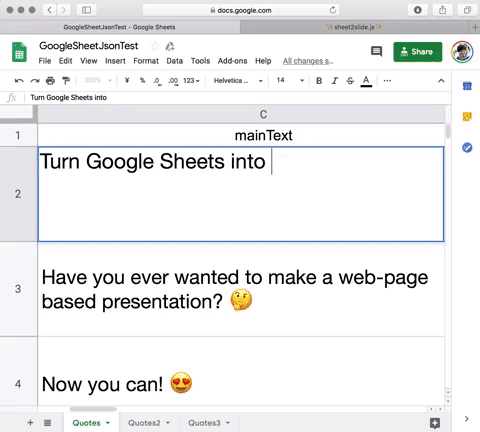

# sheet2slide.js

Exploration of turning googlesheet into presentation slides.
https://kihapper.github.io/sheet2slide.js




## Use Google Sheet to make presentation slides

Have you ever wanted to make a web-page based presentation? 🤔 
Now you can! All the text of the slide are from this Google Sheet [here](https://docs.google.com/spreadsheets/d/1g-zeqt53tnIEecFTg6mu5yXU42dIP9uQXUHVq5eI_h8/edit?pli=1#gid=0)

You can embed link and pictures by using html tag inside the google sheet.


## How to set your google sheet up.

1. Make Google Sheets on your google drive

2. Copy your google sheet link from the browser and get your unique google drive ID from below.

    ```
    EXAMPLE
    
    https://docs.google.com/spreadsheets/d/12f1k677L0LEDuZNvVRsycUUBLteeWyGcF9vA5anFWG0/edit#gid=0
    
    In the link above your ID is "12f1k677L0LEDuZNvVRsycUUBLteeWyGcF9vA5anFWG0"

    ```

3. From [Files -> Publish to Web] pulish the google sheet to the web.

4. Put your ID in the link format below to turn the web link into JSON format.

    ```
    EXAMPLE
    https://spreadsheets.google.com/feeds/list/ YOUR ID GOES HERE /1/public/values?alt=json

    Put your ID in the "YOUR ID GOES HERE"
    https://spreadsheets.google.com/feeds/list/12f1k677L0LEDuZNvVRsycUUBLteeWyGcF9vA5anFWG0/1/public/values?alt=json
    ```
5. Add the editted url to the javascript file and you are ready to go!


 
